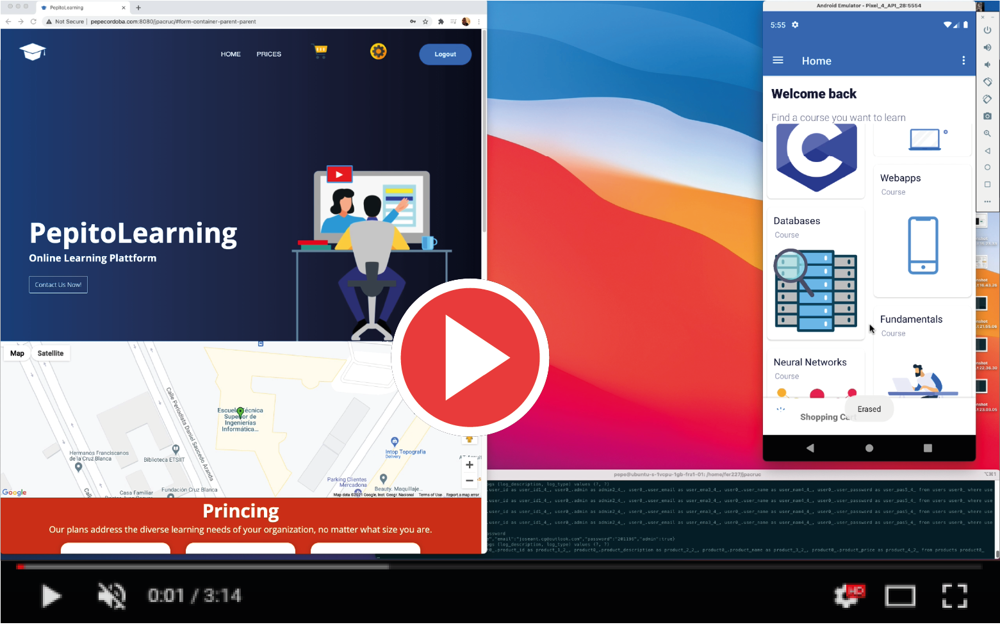

# PepitoLearning Android

  

It is a client for the [PepitoLearning enterprise application](https://www.github.com/pepitoenpeligro/PepitoLearningEnterpriseApp).

## Demo

#### Demo with Android Studio Emulator (QEMU based)

#### Demo in Real Android Device

## Tributes

It has been developed for the course Design of Software Systems Based on Components and Services (DSSBCS) of the Master in Computer Engineering of the University of Granada in the academic year 2020-2021 by:

1. José Antonio Córdoba Gómez ([@pepitoenpeligro](https://www.github.com/pepitoenpeligro))
2. Fernando Izquierdo Romera ([@fer227](https://www.github.com/fer227))

*PepitoLearning is [@pepitoenpeligro's](https://www.github.com/pepitoenpeligro) idea*